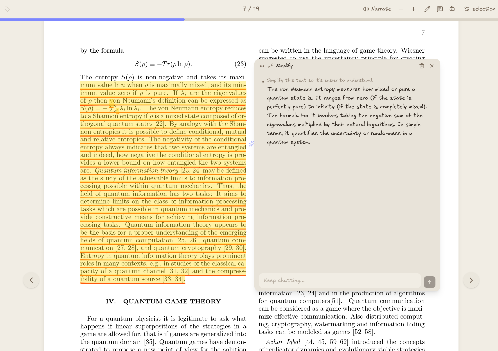

# ReHero

> Read research papers with an AI copilot, sketch annotations, and a whiteboard. Bring your own LLM: run one locally or plug in an API key.

<p align="center">
  
</p>

ReHero puts AI explanations, hand-drawn annotations, and a drawing canvas right alongside your PDF. Highlight text and the AI simplifies, explains, illustrates, or diagrams it without leaving the page. No cloud lock-in.

## What it does

| | |
|---|---|
| **Ask AI inline** | Select text, get it simplified, clarified, given examples, or turned into a Mermaid diagram |
| **Hand-drawn doodles** | Underline, strikethrough, squiggle with adjustable color, strokes, and roughness |
| **Sketch canvas** | Excalidraw board docked to the side. Push text or diagrams straight onto it |
| **Audio narration** | Kokoro TTS reads pages aloud in natural language, saved per paper |
| **Smart search** | Semantic arXiv search with AI-ranked results + DOAB open-access books |
| **Scholar XP** | 7 tier levels + 18 achievements for reading streaks, annotations, and more |

## Quick Start

```bash
npm install
npm run dev
```

Open `http://localhost:1420`, add a PDF, and start reading. Select text and right-click to bring up the action menu.

For desktop: use `npm run tauri dev` instead.

### AI Setup

Go to **Settings > AI/LLM** to pick a provider:

- **Ollama** (local, free): run `ollama serve`, point at `http://localhost:11434`, hit "Detect"
- **Anthropic / OpenAI / OpenCode**: paste an API key (encrypted on disk)

## Requirements

- **Node.js** 18+
- An **AI provider** for the AI features (Ollama, Anthropic, OpenAI, or OpenCode)
- **Audio**: Python 3 + `ffmpeg` on PATH, then `./start_kokoro.sh` (one-time venv setup)

## Other Commands

`npm run build` (production) · `npm run tauri build` (desktop installer) · `npm run lint`

## How It Works

See [AGENTS.md](./AGENTS.md) for architecture, LLM streaming, and state management.
